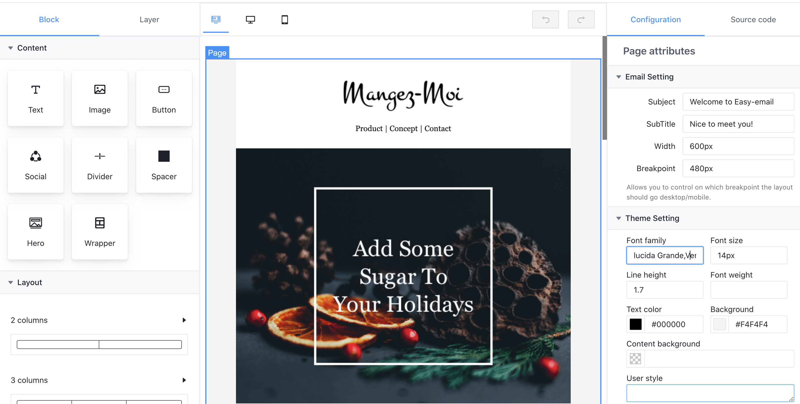

# Easy email

<br>
<p align="center">
  <a aria-label="Easy email logo" href="http://email.maocanhua.cn/">
    
  </a>
</p>
<br>

<p align="center">

  
  <a aria-label="NPM version" href="https://www.npmjs.com/package/easy-email-editor">
    
  </a>
  <a aria-label="React version" href="https://react.js">
    
  </a>
  <a aria-label="MJML" href="https://mjml.io/">
    
  </a>
  <a aria-label="Package size" href="https://www.typescriptlang.org/">
    
  </a>
  
</p>

## Introduction

Easy email is developed based on the [MJML](https://mjml.io/) and has very good compatibility. At the same time, it can generate code through drag-and-drop editing.

## Features:

- Drag and drop editor
- Can be converted into `MJML`, or generated through `MJML`
- Defined custom block
- Dynamic rendering
- Easily customize UI when you need
- Theme configuration

|                                                       Video Overview                                                       |
| :------------------------------------------------------------------------------------------------------------------------: |
| <a href="https://www.bilibili.com/video/BV1YQ4y167bb" target="_blank"></a> |
|                              Watch video overview:https://www.bilibili.com/video/BV1YQ4y167bb                              |

## Live Demo

Check out the live demo here: <a href="http://easy-email-m-ryan.vercel.app" target="_blank" alt="http://easy-email-m-ryan.vercel.app">http://easy-email-m-ryan.vercel.app</a>

## Getting started

```sh
$ npm install --save easy-email-core easy-email-editor easy-email-extensions react-final-form
```

or

```sh
$ yarn add easy-email-core easy-email-editor easy-email-extensions react-final-form
```

```js
import React from 'react';
import { BlockManager, BasicType, AdvancedType } from 'easy-email-core';
import { EmailEditor, EmailEditorProvider } from 'easy-email-editor';
import { ExtensionProps, StandardLayout } from 'easy-email-extensions';
import { useWindowSize } from 'react-use';

import 'easy-email-editor/lib/style.css';
import 'easy-email-extensions/lib/style.css';

// theme, If you need to change the theme, you can make a duplicate in https://arco.design/themes/design/1799/setting/base/Color
import '@arco-themes/react-easy-email-theme/css/arco.css';

const categories: ExtensionProps['categories'] = [
  {
    label: 'Content',
    active: true,
    blocks: [
      {
        type: AdvancedType.TEXT,
      },
      {
        type: AdvancedType.IMAGE,
        payload: { attributes: { padding: '0px 0px 0px 0px' } },
      },
      {
        type: AdvancedType.BUTTON,
      },
      {
        type: AdvancedType.SOCIAL,
      },
      {
        type: AdvancedType.DIVIDER,
      },
      {
        type: AdvancedType.SPACER,
      },
      {
        type: AdvancedType.HERO,
      },
      {
        type: AdvancedType.WRAPPER,
      },
    ],
  },
  {
    label: 'Layout',
    active: true,
    displayType: 'column',
    blocks: [
      {
        title: '2 columns',
        payload: [
          ['50%', '50%'],
          ['33%', '67%'],
          ['67%', '33%'],
          ['25%', '75%'],
          ['75%', '25%'],
        ],
      },
      {
        title: '3 columns',
        payload: [
          ['33.33%', '33.33%', '33.33%'],
          ['25%', '25%', '50%'],
          ['50%', '25%', '25%'],
        ],
      },
      {
        title: '4 columns',
        payload: [[['25%', '25%', '25%', '25%']]],
      },
    ],
  },
];

const initialValues = {
  subject: 'Welcome to Easy-email',
  subTitle: 'Nice to meet you!',
  content: BlockManager.getBlockByType(BasicType.PAGE)!.create({}),
};

export default function App() {
  const { width } = useWindowSize();

  const smallScene = width < 1400;

  return (
    <EmailEditorProvider
      data={initialValues}
      height={'calc(100vh - 72px)'}
      autoComplete
      dashed={false}
    >
      {({ values }) => {
        return (
          <StandardLayout
            compact={!smallScene}
            categories={categories}
            showSourceCode={true}
          >
            <EmailEditor />
          </StandardLayout>
        );
      }}
    </EmailEditorProvider>
  );
}


```

## Examples

> Please see <a href="https://github.com/m-Ryan/easy-email-demo" target="_blank" alt="https://github.com/m-Ryan/easy-email-demo">https://github.com/m-Ryan/easy-email-demo</a>

</br>

## Configuration

| property           | Type                                                                                               | Description                                                                                                                          |
| ------------------ | -------------------------------------------------------------------------------------------------- | ------------------------------------------------------------------------------------------------------------------------------------ |
| height             | string / number                                                                                    | Set the height of the container                                                                                                      |
| data               | interface IEmailTemplate { content: IPage; subject: string; subTitle: string; }                    | Source data                                                                                                                          |
| children           | ( props: FormState<T>,helper: FormApi<IEmailTemplate, Partial<IEmailTemplate>>) => React.ReactNode | ReactNode                                                                                                                            |
| onSubmit           | Config<IEmailTemplate, Partial<IEmailTemplate>>['onSubmit'];                                       | Called when the commit is triggered manually                                                                                         |
| fontList           | { value: string; label: string; }[];                                                               | Default font list.                                                                                                                   |
| interactiveStyle   | { hoverColor?: string; selectedColor?: string;}                                                    | Interactive prompt color                                                                                                             |
| onUploadImage      | (data: Blob) => Promise<string>;                                                                   | Triggered when an image is pasted or uploaded                                                                                        |
| onAddCollection    | (payload: CollectedBlock) => void;                                                                 | Add to collection list                                                                                                               |
| onRemoveCollection | (payload: { id: string; }) => void;                                                                | Remove from collection list                                                                                                          |
| dashed             | boolean                                                                                            | Show dashed                                                                                                                          |
| autoComplete       | boolean                                                                                            | Automatically complete missing blocks. For example, Text => Section, will generate Text=>Column=>Section                             |
| mergeTags          | Object                                                                                             | A merge tag is a bit of specific code that allows you to insert dynamic data into emails. Like `{{user.name}}`, and used for preview |
| previewInjectData  | Object                                                                                             | Dynamic data for preview, it will overwrite mergeTags.                                                                               |
| onBeforePreview    | (html: string, mergeTags: PropsProviderProps['mergeTags']) => string                               | Promise<string> You can replace mergeTags when previewing.                                                                           |

## Hotkeys

| hotkey            | Description                                                                                       |
| ----------------- | ------------------------------------------------------------------------------------------------- |
| mod+z             | undo                                                                                              |
| mod+y             | redo                                                                                              |
| delete/backspace  | delete block                                                                                      |
| tab / shift + tab | fast select block, if block is focusing,`tab` select next block & `shift + tab` select prev block |

## Packages

- [easy-email-core](./packages/easy-email-core/readme.md)
- [easy-email-editor](./packages/easy-email-editor/readme.md)
- [easy-email-extensions](./packages/easy-email-extensions/readme.md)

</br>

## How does it work?


</br>

## Roadmap

- I18n support
- Awesome responsive, support mobile and desktop display different styles (without any compatibility issues)
- Replace shadow dom with iframe, support firefox/safari browsers.
- Improve documentation and add more usage examples

## Donation

If you like this project, please consider donating.

<a href="https://www.buymeacoffee.com/easyemail" target="_blank"></a>

## Development

```sh
$ git clone git@github.com:arco-design/easy-email.git
$ cd easy-email
$ yarn install-all
$ yarn dev

```

## License

The MIT License
