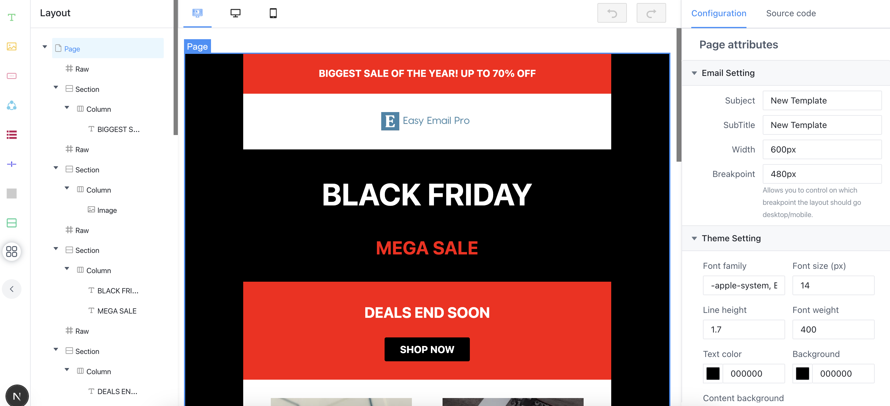

# Easy email

<br>
<p align="center">
  <a aria-label="Easy email logo" href="https://email.maocanhua.cn/?utm_source=github">
    
  </a>
</p>
<p align="center">
  <strong>The most developer-friendly email editor based on MJML</strong>
</p>
<br>

<p align="center">
  
  <a aria-label="React version" href="https://react.js">
    
  </a>
  <a aria-label="MJML" href="https://mjml.io/">
    
  </a>
  <a aria-label="Package size" href="https://www.typescriptlang.org/">
    
  </a>
</p>

---

> 💼 **Looking for more features?** Check out [Easy Email Pro](https://www.easyemail.pro/?utm_source=github) with cross-browser support, responsive design, and premium components.

---

## Introduction

Easy email is developed based on the [MJML](https://mjml.io/) and has very good compatibility. At the same time, it can generate code through drag-and-drop editing.

|                 Video Overview                 |
| :--------------------------------------------: |
|  |

## 🎮 Live Demo

- **Open Source**: [open-source.easyemail.pro](https://open-source.easyemail.pro/?utm_source=github)
- **Pro Version**: [demo.easyemail.pro](https://demo.easyemail.pro/full?utm_source=github-live)

## 📧 Free Email Templates

Looking for ready-to-use templates? Check out our free collection of [MJML and HTML email templates](https://github.com/Easy-Email-Pro/email-templates).

## 🚀 Getting Started

```sh
$ npm install --save easy-email-core easy-email-editor easy-email-extensions react-final-form
```

```js
import React from 'react';
import { BlockManager, BasicType, AdvancedType } from 'easy-email-core';
import { EmailEditor, EmailEditorProvider } from 'easy-email-editor';
import { ExtensionProps, StandardLayout } from 'easy-email-extensions';

import 'easy-email-editor/lib/style.css';
import 'easy-email-extensions/lib/style.css';
import '@arco-themes/react-easy-email-theme/css/arco.css';

const initialValues = {
  subject: 'Welcome to Easy-email',
  subTitle: 'Nice to meet you!',
  content: BlockManager.getBlockByType(BasicType.PAGE)!.create({}),
};

export default function App() {

  return (
    <EmailEditorProvider
      data={initialValues}
      height={'calc(100vh - 72px)'}
      autoComplete
      dashed={false}
    >
      {({ values }) => {
        return (
          <StandardLayout
            showSourceCode={true}
          >
            <EmailEditor />
          </StandardLayout>
        );
      }}
    </EmailEditorProvider>
  );
}


```

</br>

## ⚙️ Configuration

| property      | Type                                                                                               | Description                                   |
| ------------- | -------------------------------------------------------------------------------------------------- | --------------------------------------------- |
| height        | string / number                                                                                    | Set the height of the container               |
| data          | interface IEmailTemplate { content: IPage; subject: string; subTitle: string; }                    | Source data                                   |
| children      | ( props: FormState<T>,helper: FormApi<IEmailTemplate, Partial<IEmailTemplate>>) => React.ReactNode | ReactNode                                     |
| onSubmit      | Config<IEmailTemplate, Partial<IEmailTemplate>>['onSubmit'];                                       | Called when the commit is triggered manually  |
| fontList      | { value: string; label: string; }[];                                                               | Default font list.                            |
| onUploadImage | (data: Blob) => Promise<string>;                                                                   | Triggered when an image is pasted or uploaded |

</br>

## 📊 Open Source vs Pro Version

| Feature                   | Open Source Version  | Pro Version                                                               |
| ------------------------- | -------------------- | ------------------------------------------------------------------------- |
| **Browser Compatibility** | Only supports Chrome | Compatible with various browsers (uses iframe)                            |
| **React 19 Support**      | ❌ Not supported     | ✅ Supported                                                              |
| **Responsive Design**     | ❌ Not available     | ✅ Supports different UI for desktop and mobile                           |
| **Advanced Features**     | Basic features only  | Unsplash library, File Manager, Block Studio, and many more custom blocks |
| **Technical Support**     | Community support    | Professional technical support with faster response times                 |

Learn more about [Easy Email Pro](https://www.easyemail.pro/?utm_source=github).

## 🛠️ Development

```sh
$ git clone git@github.com:zalify/easy-email.git
$ cd easy-email


$ pnpm install
$ pnpm run install-all
$ pnpm run dev

```

`If you need some new features, we always welcome you to submit a PR.`

## 📄 License

The MIT License
